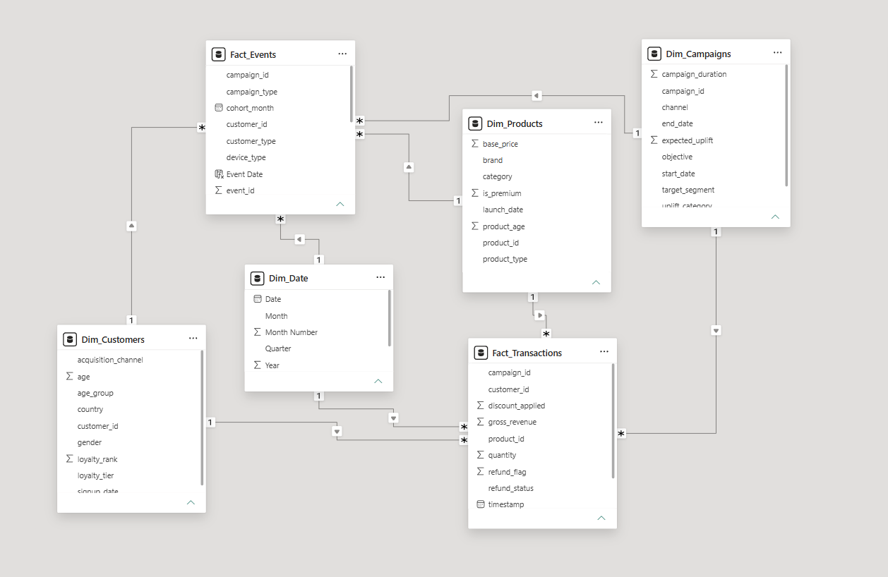
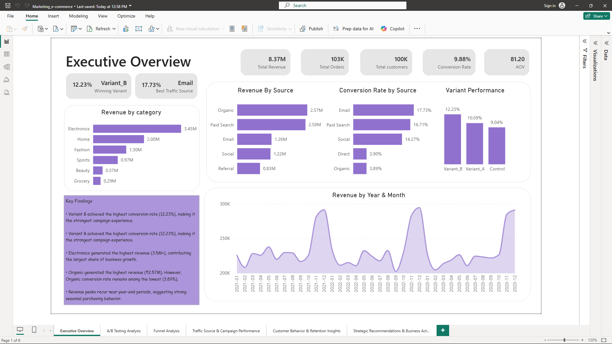
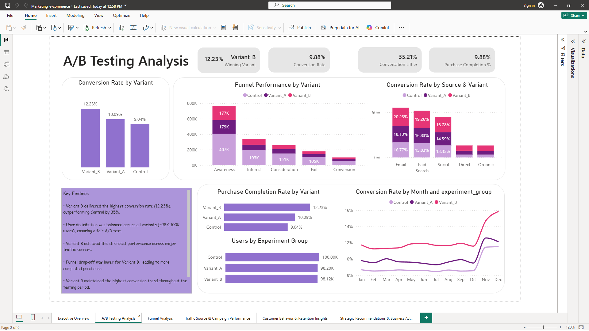
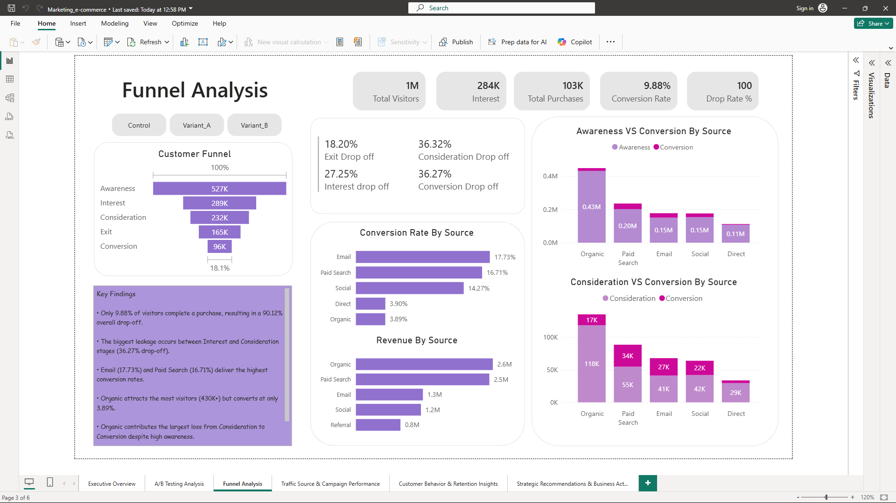
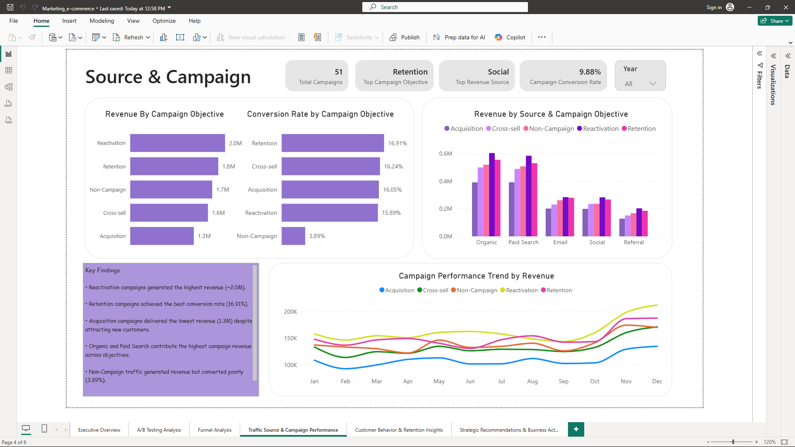
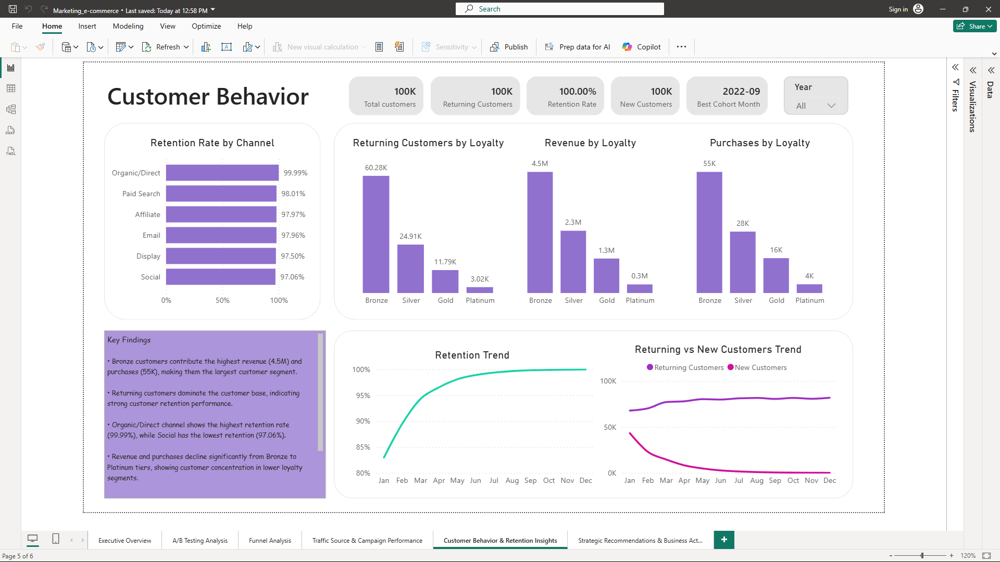
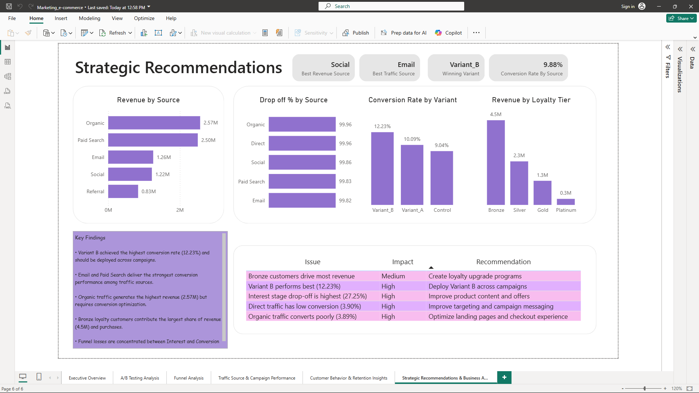
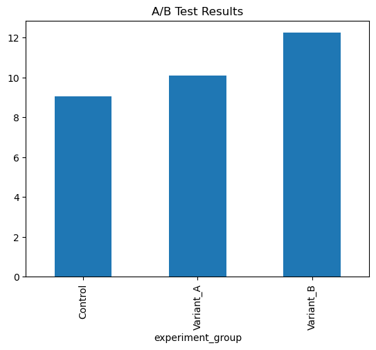
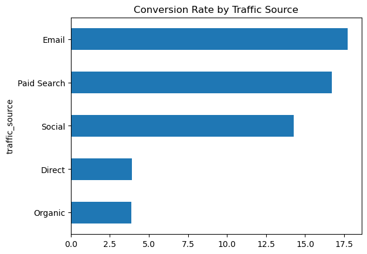

# Marketing Growth & Customer Retention Optimization

## Solving Real Business Problems Using A/B Testing, Funnel Analytics, Customer Retention & Marketing Performance Analysis

---

## Project Overview

This project was developed to analyze customer behavior, campaign effectiveness, conversion performance, customer retention, and marketing growth using a large-scale e-commerce dataset.

The goal was not simply to build dashboards.

The goal was to identify business problems, perform root cause analysis, measure marketing effectiveness, and provide actionable recommendations that stakeholders can use to improve business performance.

---

## Business Problems Solved

### Marketing Teams Need To Know

* Which campaign objectives generate the highest revenue?
* Which traffic sources generate quality customers?
* Which marketing channels convert best?

### Product Teams Need To Know

* Where do customers drop off in the purchase journey?
* Which funnel stage causes the largest revenue loss?

### Growth Teams Need To Know

* Which A/B testing variant should be deployed?
* How much conversion uplift can be achieved?

### Customer Teams Need To Know

* Which customer segments generate the highest revenue?
* How strong is customer retention?
* Which loyalty tiers drive business growth?

---

# Project Scale

| Metric          | Value     |
| --------------- | --------- |
| Customers       | 100,000   |
| Products        | 2,000     |
| Campaigns       | 50        |
| Transactions    | 103,000+  |
| Customer Events | 2,000,000 |
| Funnel Stages   | 5         |
| Traffic Sources | 5         |
| A/B Variants    | 3         |

---

# Key Challenges Solved

## Challenge 1 – Large Event Dataset

### Problem

The Events dataset contained:

* 2,000,000 customer interaction records
* Large file size
* High volume behavioral tracking data

### Solution

* Performed cleaning and feature engineering using Python
* Conducted exploratory data analysis
* Extracted meaningful behavioral insights

### Business Impact

* Enabled customer journey analysis
* Supported funnel optimization
* Supported conversion analysis

---

## Challenge 2 – Complex Data Modeling

### Problem

The project required combining multiple business entities:

* Customers
* Products
* Campaigns
* Transactions

while maintaining analytical accuracy.

### Solution

* Designed a Star Schema data model
* Created Fact and Dimension tables
* Built scalable relationships in Power BI

### Business Impact

* Improved reporting performance
* Enabled cross-functional analysis
* Supported executive-level reporting

---

## Challenge 3 – Funnel Analytics

### Problem

Businesses lose customers during the purchase journey but often do not know where.

### Solution

* Built a complete funnel framework
* Measured drop-off between stages
* Compared funnel performance across traffic sources

### Business Impact

* Identified conversion bottlenecks
* Highlighted optimization opportunities
* Supported growth strategy decisions

---

# End-To-End Workflow

```text
Raw Kaggle Dataset
        ↓
Data Understanding (Excel)
        ↓
Data Cleaning
        ↓
Feature Engineering
        ↓
Python EDA
        ↓
Event Analysis
        ↓
Clean Dataset Creation
        ↓
Power BI Data Modeling
        ↓
Business KPI Development
        ↓
Dashboard Development
        ↓
Business Recommendations
```

---

# Data Architecture

## Original Dataset

Dataset Source:

https://www.kaggle.com/datasets/geethasagarbonthu/marketing-and-e-commerce-analytics-dataset

Original Files:

* campaigns.csv
* customers.csv
* products.csv
* transactions.csv
* events.csv

---

## Excel Layer

### Data_Understanding_Cleaning.xlsx

Purpose:

* Dataset understanding
* Column analysis
* Data validation
* Data cleaning
* Feature engineering

Activities Performed:

* Null value identification
* Data quality checks
* Feature creation
* Business rule implementation

Output:

* campaigns.csv
* customers.csv
* products.csv
* transactions.csv

---

## Python Layer

### e-commerce.ipynb

Purpose:

Analyze the large Events dataset separately.

Activities:

* Data cleaning
* Feature engineering
* Exploratory data analysis
* Traffic source analysis
* A/B testing analysis

Output:

* marketing_growth_cleaned.csv

---

## Power BI Layer

Purpose:

Transform analytical outputs into business insights.

Includes:

* Data modeling
* DAX calculations
* KPI reporting
* Executive dashboards
* Strategic recommendations

---

# Data Model



---

# Executive Dashboard



### Key Insights

* Revenue Performance
* Conversion Performance
* Revenue Trends
* Variant Performance
* Executive KPIs

---

# A/B Testing Analysis



### Key Findings

* Variant B delivered the highest conversion rate
* Variant B outperformed Control and Variant A
* Conversion uplift opportunities identified

### Business Decision

Deploy Variant B across future campaigns.

---

# Funnel Analysis



### Key Findings

* Significant customer drop-off before conversion
* Funnel leakage identified across stages
* Conversion opportunities highlighted

### Business Decision

Optimize stages with highest drop-off rates.

---

# Traffic Source & Campaign Performance



### Key Findings

* Campaign objectives compared
* Revenue by source analyzed
* Conversion performance measured

### Business Decision

Increase investment in high-performing traffic sources.

---

# Customer Behavior & Retention Analysis



### Key Findings

* Customer loyalty behavior analyzed
* Revenue contribution by segment measured
* Retention performance evaluated

### Business Decision

Focus on retaining high-value customer segments.

---

# Strategic Recommendations



### Recommendation Areas

* Conversion Optimization
* Campaign Optimization
* Customer Retention
* Funnel Improvement
* Revenue Growth

---

# Python Analysis

## A/B Testing Result



---

## Traffic Source Conversion Analysis



---

# Tools & Technologies

| Category      | Tools                                             |
| ------------- | ------------------------------------------------- |
| Excel         | Data Understanding, Cleaning, Feature Engineering |
| Power Query   | Data Transformation                               |
| Python        | Data Analysis                                     |
| Pandas        | Data Manipulation                                 |
| NumPy         | Numerical Analysis                                |
| Matplotlib    | Visualization                                     |
| Power BI      | Dashboarding                                      |
| DAX           | KPI Development                                   |
| Data Modeling | Star Schema                                       |

---

# Business Recommendations

### Marketing

* Scale high-performing campaigns
* Increase investment in effective channels

### Funnel Optimization

* Reduce customer drop-off
* Improve conversion journey

### Customer Retention

* Strengthen loyalty programs
* Improve repeat purchase behavior

### Executive Reporting

* Monitor KPIs continuously
* Use dashboard-driven decision making

---

# Future Enhancements

Currently learning and improving:

* Advanced Power BI Techniques
* Advanced DAX Optimization
* Business Storytelling
* Stakeholder Communication
* Executive Presentation Skills
* Business Acumen
* Data-Driven Decision Making

Future versions may include:

* Cohort Analysis
* Customer Lifetime Value Analysis
* Predictive Analytics
* Automated KPI Monitoring

---

# Author

**Aloycious James**

Aspiring Data Analyst

Skills Demonstrated:

* A/B Testing Analysis
* Funnel Analytics
* Customer Analytics
* Customer Retention Analysis
* Marketing Analytics
* Data Modeling
* Business Intelligence
* Dashboard Development
* Business Problem Solving
* Data Storytelling
