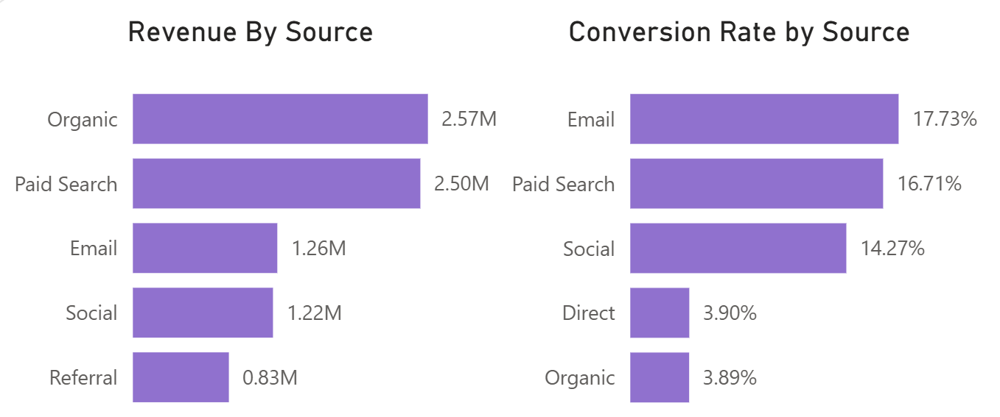
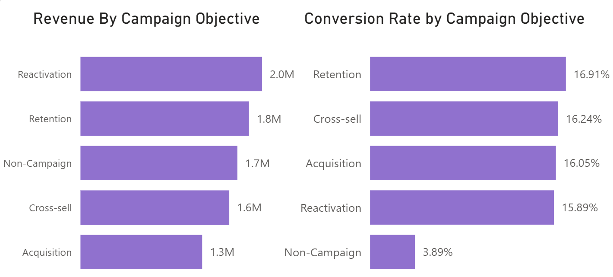
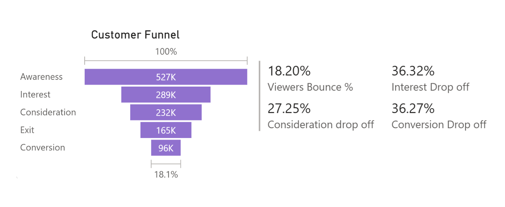
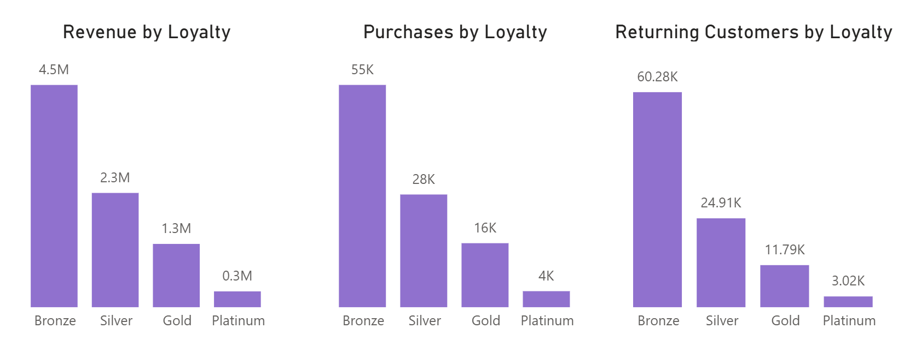
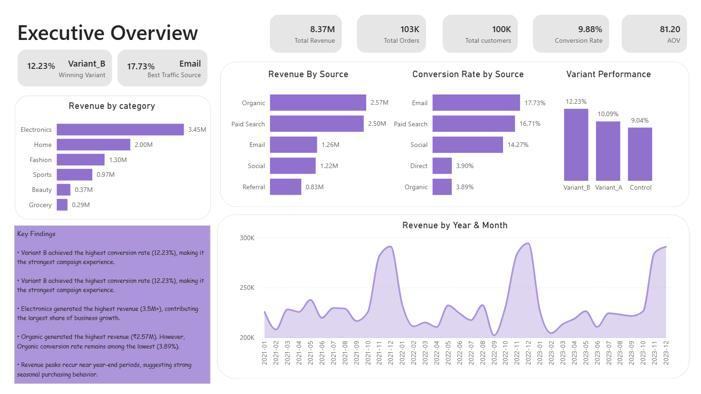
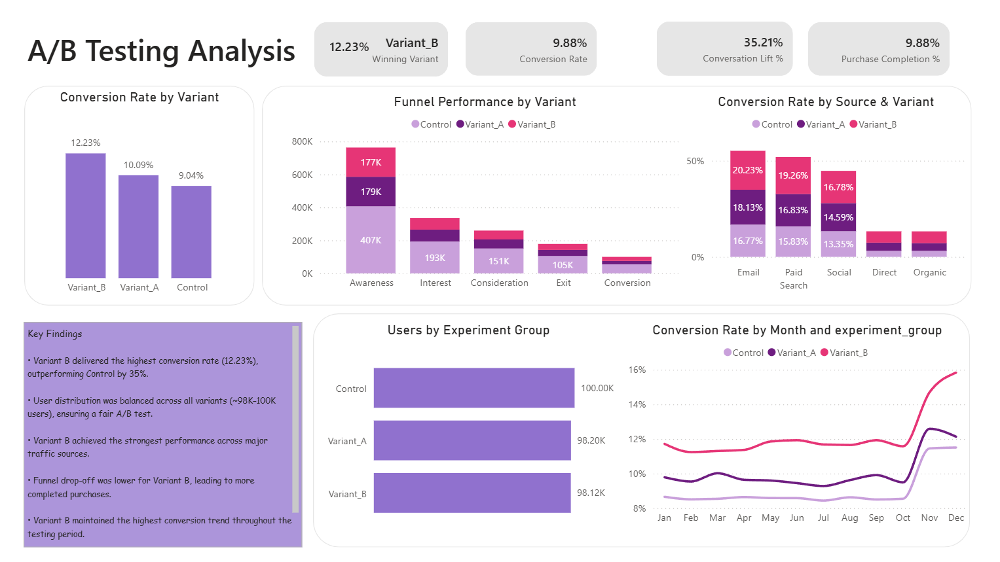
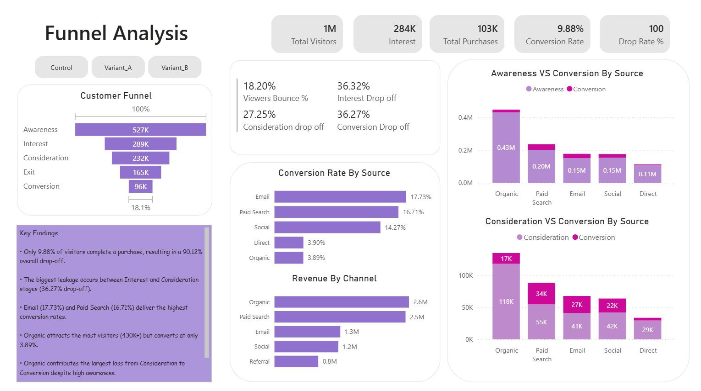
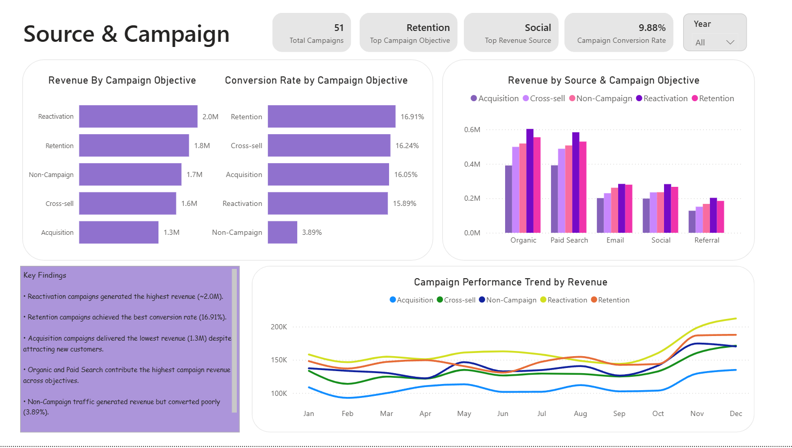
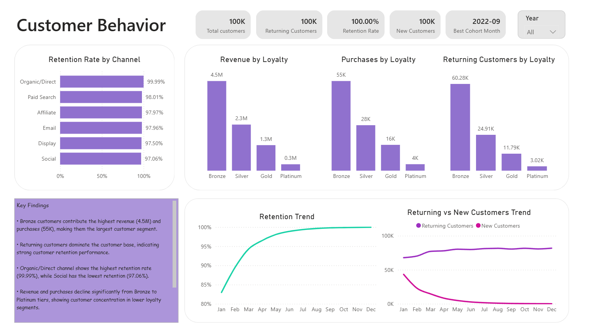

# Marketing Growth & Customer Retention Analytics

An analysis of a 100,000-customer e-commerce business built around three questions marketing, product, and growth teams actually fight over: which channels are worth the budget, whether the new experience is really better, and where the funnel is bleeding customers. Excel for data cleaning and feature engineering, Python for the 2-million-row event log, Power BI and DAX for the reporting layer, with a statistical significance test behind the one recommendation everyone wants to make on gut feel alone.

**Tools:** Excel · Power Query · Python (Pandas, NumPy, SciPy, Matplotlib) · Power BI · DAX

---

## The Business Problem

The company acquires customers through five channels (Organic, Paid Search, Email, Social, Direct), runs campaigns against five objectives (Acquisition, Retention, Reactivation, Cross-sell, Non-Campaign), and is mid-way through an A/B test on a redesigned experience. Leadership had the raw data — 2 million tracked events, 103,000 transactions, 100,000 customers — but no single view tying spend to conversion quality, no statistical backing for the A/B test decision everyone was already leaning toward, and no clear read on where in the funnel customers were actually being lost.

Four questions shaped the analysis:

1. Which channels and campaign objectives generate revenue because of *volume*, and which generate it because of *conversion efficiency* — and are those the same channels?
2. Does the A/B test variant actually outperform Control, or does it just look better on a chart?
3. Where in the funnel is the real leakage concentrated, and is it a UX problem or something further upstream?
4. Is the loyalty program actually structured around customer value, or just customer count?

## Who Would Use This

| Team | What they'd pull from it |
|---|---|
| Growth / Performance Marketing | Which channels and campaign objectives to fund based on conversion efficiency, not just revenue share |
| Product / Experimentation | A statistically validated read on the A/B test, ready to act on without re-running the analysis |
| Product / UX | Exactly which funnel stages account for the drop-off, instead of redesigning everything at once |
| CRM / Loyalty | Whether the loyalty tier structure lines up with actual customer value |
| Finance / Leadership | Revenue, AOV, and conversion rate at a glance, filterable by year |

---

## About the Dataset

Source: [Marketing & E-Commerce Analytics Dataset on Kaggle](https://www.kaggle.com/datasets/geethasagarbonthu/marketing-and-e-commerce-analytics-dataset) — a synthetic, multi-table dataset purpose-built for marketing funnel and A/B testing practice, which is exactly the shape this project needed: customers, products, campaigns, and transactions as relational tables, plus a 2-million-row event log with funnel stages and experiment groups baked in.

- **100,000 customers**, 2,000 products, 50 campaigns, 103,127 transactions, 2,000,000 tracked events
- Events carry `event_type` (view, click, add_to_cart, purchase, bounce), `traffic_source`, `device_type`, `page_category`, `session_duration_sec`, and `experiment_group` (Control / Variant_A / Variant_B) — this is what makes the funnel and A/B analysis possible

**What I'd flag before treating every number here as a real-world signal:** because it's synthetic, a couple of relationships don't hold up the way they would in a real customer base. `loyalty_tier` in the customer table shows no relationship to age or signup date — every tier has essentially the same average age, which means it was assigned at signup rather than earned through behavior. And the simplest retention measure (new vs. returning customers by month) mechanically climbs toward 100% by 2022, because new customer signups taper off in the underlying data — by late 2022 there are almost no new customers left to bring the ratio down, which makes the metric look like flawless retention when it's really just an artifact of how the dataset was generated. I used cohort-based retention instead for that reason (below), and called out the loyalty tier issue directly in the insights rather than reporting it at face value.

---

## Data Model

Star schema in Power BI: `Fact_Transactions` and `Fact_Events` as the two fact tables, with `Dim_Customers`, `Dim_Products`, `Dim_Campaigns`, and `Dim_Date` as shared dimensions across both.


---

## Method

**Excel** — data understanding, validation, and feature engineering on the four smaller tables (customers, products, campaigns, transactions): added `age_group` and `loyalty_rank` to customers, `product_type` and `product_age` to products, `campaign_duration` and an uplift category to campaigns, and a `refund_status` field to transactions.

**Python** (`e-commerce.ipynb`) — the events table (2 million rows) doesn't open cleanly in Excel, so it got its own pipeline:
- Mapped raw `event_type` values to funnel stages (view → Awareness, click → Interest, add_to_cart → Consideration, purchase → Conversion)
- Engineered `session_bucket` (Short/Medium/Long), `campaign_type` (Organic/Direct vs. Campaign Driven), `cohort_month`, and `customer_type` (New vs. Returning)
- Ran conversion-rate breakdowns by traffic source, device, page category, and session length
- Validated the A/B test with a chi-square test of independence rather than just comparing percentages
- Built a cohort retention matrix (first-purchase-month cohorts tracked forward)

| A/B Test | Control | Variant_A | Variant_B |
|---|---|---|---|
| Conversion rate | 9.04% | 10.09% | 12.23% |

Chi-square statistic: **1781.13**, p-value: **< 0.0001** — the difference between groups is statistically significant, not sampling noise. Variant B represents a **+35.29% lift** over Control.


**Power BI** — star schema, DAX measures, and five report pages translating the above into something a non-technical stakeholder can act on without reading the notebook.

---

## What the Data Shows

The same pattern shows up twice, independently, in two different parts of the business: **the channel or objective that brings in the most revenue is rarely the one converting most efficiently.** That's not a coincidence worth ignoring — it's a sign that revenue share and funnel health need to be reported side by side, not as separate KPIs.

**Traffic sources split into three groups, not two.** Organic brings in the most revenue ($2.57M) but converts at 3.89% — the worst of any channel, on par with Direct (3.90%). Email converts best by far (17.73%, more than 4x Organic's rate) on under half of Organic's revenue. Paid Search is the outlier that actually matters most: it's both the second-highest revenue channel ($2.50M) *and* the second-best converter (16.71%) — strong on both axes, which none of the others manage. If the goal is efficient growth rather than raw traffic, Paid Search and Email are earning their budget; Organic's volume is real but is being wasted on a weak landing/targeting experience; Direct is the one channel with no clear strength on either dimension.



**The exact same shape repeats at the campaign level.** Reactivation campaigns generate the most revenue ($2.0M) but convert worst of any *actual* campaign objective (15.89%, barely ahead of untargeted Non-Campaign traffic at 3.89%). Retention campaigns are the best performer on both counts that matter — second-highest revenue ($1.8M) and the best conversion rate (16.91%). Acquisition, notably, generates the least revenue of any objective ($1.3M) despite converting competitively (16.05%) — worth checking whether Acquisition is simply underfunded relative to Retention and Reactivation, rather than assuming it's a weaker objective.



**The funnel doesn't leak evenly — it leaks in two places, almost equally.** Of roughly 527K users entering at Awareness, only 9.88% ultimately purchase. The Interest stage loses 36.32%, and a nearly identical share (36.27%) is lost at the stage right before Conversion. Two leaks of almost the same size means this isn't a single-fix problem — the mid-funnel drop (Interest → Consideration) and the pre-purchase drop need separate root-cause work, not one redesign aimed at "the funnel" generally.



**Device, page, and session length barely move the needle — which is itself the finding.** Conversion sits at 9.87% on desktop, 9.88% on mobile, 9.94% on tablet — a 0.07-point spread across three completely different experiences. Session length shows the same flatness, and counterintuitively, long sessions convert slightly *worse* than short ones (9.61% vs. 9.86%) — more time on site isn't a signal of purchase intent here. Combined with the funnel result above, this rules out "fix the mobile experience" or "keep people engaged longer" as the lever. The problem is upstream of behavior — likely targeting or offer fit — not a UX or engagement problem.

**The loyalty program's top tier isn't its top-value segment.** Tier is unrelated to customer age or signup date, meaning it's assigned at signup rather than earned. Per customer, revenue actually peaks at Gold (~$110), not Platinum (~$99) — the tier positioned as the top reward is, per capita, outspent by the tier below it. Bronze still drives the most *total* revenue simply because it's 20x larger than Platinum by customer count, which is expected for a pyramid-shaped program — but the per-customer inversion at the top is not, and is worth a direct conversation with whoever owns the loyalty program's design.



---

## Recommendations

| Recommendation | Why | Expected impact |
|---|---|---|
| Shift incremental budget toward Paid Search and Email; fund a landing-page/targeting fix for Organic before scaling it further | Paid Search wins on revenue and conversion; Email converts 4x better than Organic on a fraction of the spend | Better revenue per acquisition dollar, not just more traffic |
| Deploy Variant B to 100% of traffic | Statistically validated lift of +35.29% over Control (chi-square p < 0.0001) | Immediate conversion gain with no further testing needed |
| Treat Interest→Consideration and the pre-purchase stage as two separate problems | Both account for a ~36% loss each — fixing one won't fix the other | Targeted funnel work instead of a broad, unfocused redesign |
| Deprioritize device-specific and engagement-length UX work | Conversion is flat within 0.1pt across devices and session lengths | Frees budget for the targeting/offer-fit work that actually moves the number |
| Audit whether Acquisition campaigns are underfunded relative to Retention/Reactivation | Acquisition converts competitively (16.05%) but earns the least revenue of any objective | Clarifies whether this is a funding gap or a genuine performance gap |
| Review whether loyalty tier reflects real customer value | Tier is unrelated to tenure, and Gold outspends Platinum per capita | A loyalty program that rewards the wrong tier undermines its own purpose |

---

## Dashboards

**Executive Overview** — revenue, orders, customers, conversion rate, and AOV at a glance, with revenue by category, source, and time.



**A/B Testing Analysis** — conversion rate by variant, funnel performance by variant, and conversion by source and month, split by experiment group.



**Funnel Analysis** — the five-stage funnel with stage-to-stage drop-off, plus conversion by source layered on top.



**Traffic Source & Campaign Performance** — revenue and conversion by campaign objective, and revenue by source crossed with objective.



**Customer Behavior & Retention** — retention by acquisition channel, and revenue, purchases, and returning customers by loyalty tier.



**Python — Traffic Source Conversion**


---

## Repository Structure

```
marketing-growth-customer-retention-analytics/
├── Excel/               Data_Understanding_Cleaning.xlsx — validation and feature engineering
├── Python/              e-commerce.ipynb — event-log cleaning, funnel mapping, A/B significance test, cohort analysis
├── PowerBI/              Power BI dashboard file
├── Images/               dashboard exports, data model, and Python chart outputs used in this README
└── README.md
```

---

## Author

**Aloycious James**
Excel · Python · Power BI · DAX · Statistical Testing · Business Analytics
