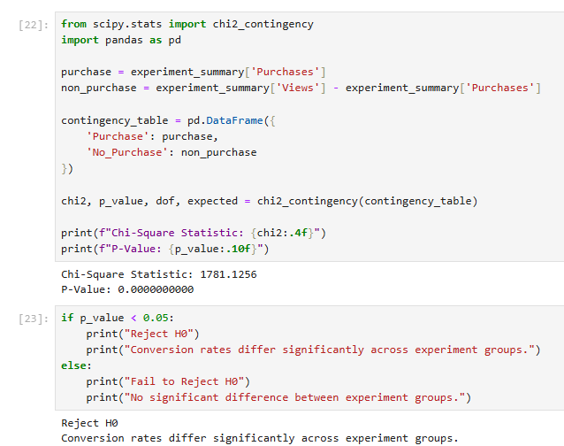
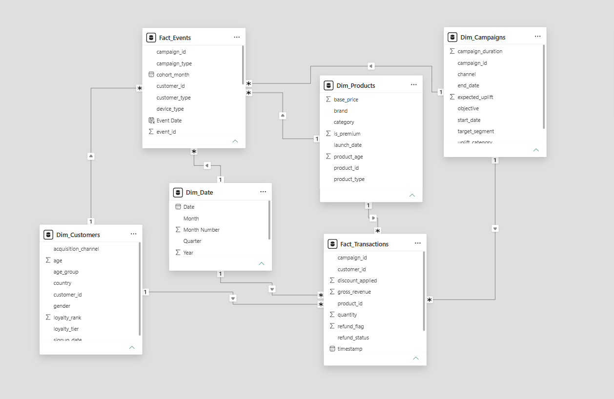
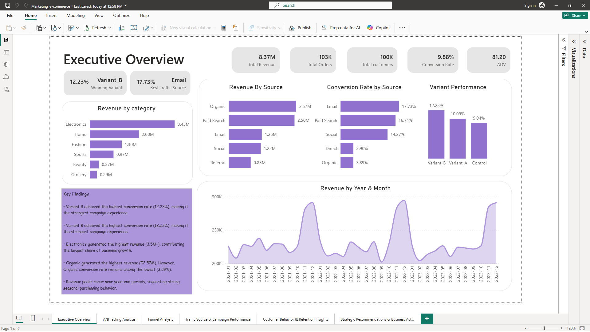
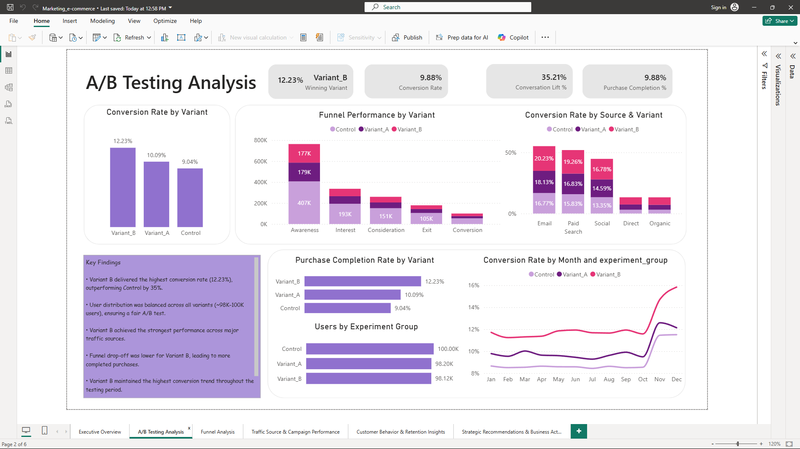
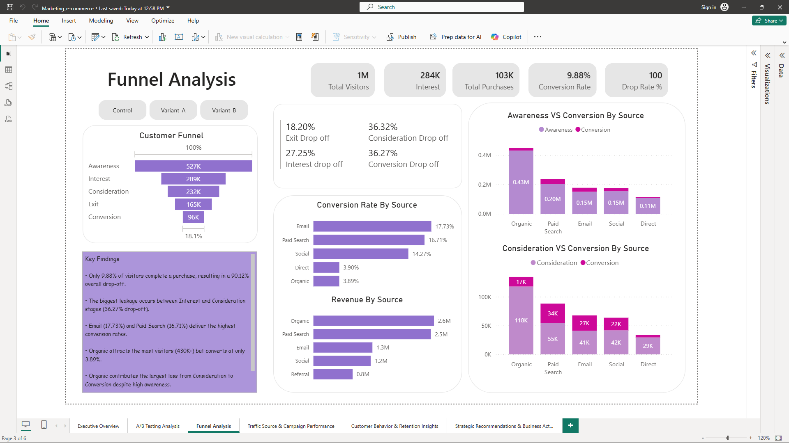
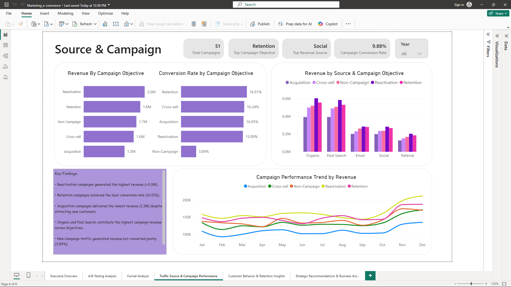
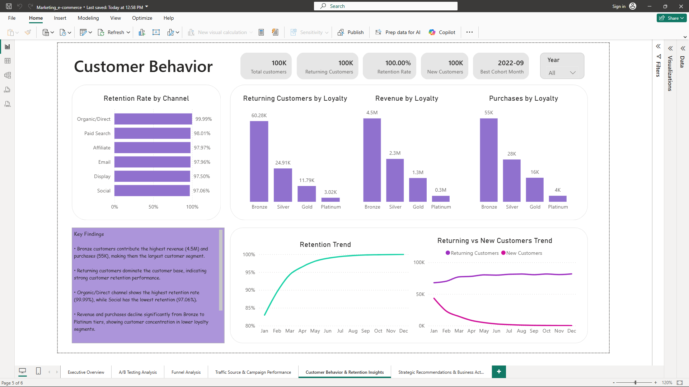
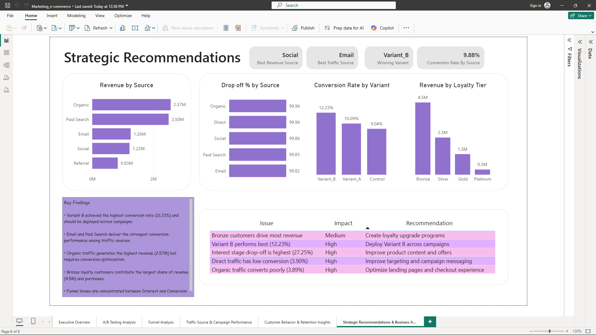
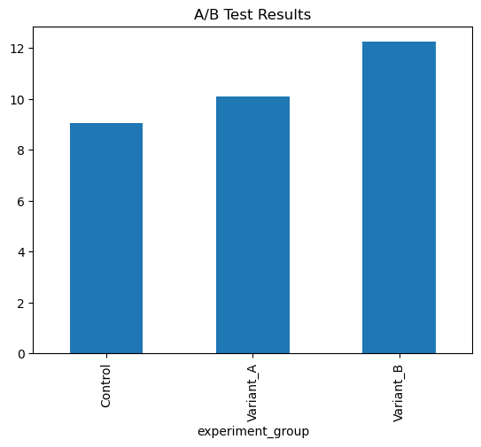
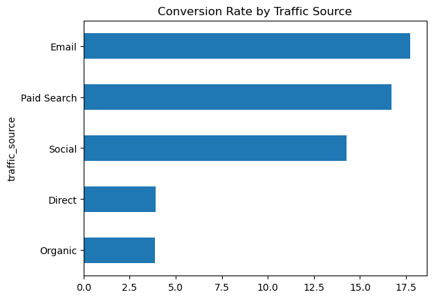

# Marketing Growth & Customer Retention Optimization

## Solving Real Business Problems Using A/B Testing, Funnel Analytics, Customer Retention & Marketing Performance Analysis

---

## Project Overview

This project was developed to analyze customer behavior, campaign effectiveness, conversion performance, customer retention, and marketing growth using a large-scale e-commerce dataset.

The goal was not simply to build dashboards.

The goal was to identify business problems, perform root cause analysis, measure marketing effectiveness, and provide actionable recommendations that stakeholders can use to improve business performance.

---

## Business Problems Solved

### Marketing Teams Need To Know

* Which campaign objectives generate the highest revenue?
* Which traffic sources generate quality customers?
* Which marketing channels convert best?

### Product Teams Need To Know

* Where do customers drop off in the purchase journey?
* Which funnel stage causes the largest revenue loss?

### Growth Teams Need To Know

* Which A/B testing variant should be deployed?
* How much conversion uplift can be achieved?

### Customer Teams Need To Know

* Which customer segments generate the highest revenue?
* How strong is customer retention?
* Which loyalty tiers drive business growth?

---

# Project Scale

| Metric          | Value     |
| --------------- | --------- |
| Customers       | 100,000   |
| Products        | 2,000     |
| Campaigns       | 50        |
| Transactions    | 103,000+  |
| Customer Events | 2,000,000 |
| Funnel Stages   | 5         |
| Traffic Sources | 5         |
| A/B Variants    | 3         |

---

# Key Challenges Solved

## Challenge 1 – Large Event Dataset

### Problem

The Events dataset contained:

* 2,000,000 customer interaction records
* Large file size
* High volume behavioral tracking data

### Solution

* Performed cleaning and feature engineering using Python
* Conducted exploratory data analysis
* Extracted meaningful behavioral insights

### Business Impact

* Enabled customer journey analysis
* Supported funnel optimization
* Supported conversion analysis

---

## Challenge 2 – Complex Data Modeling

### Problem

The project required combining multiple business entities:

* Customers
* Products
* Campaigns
* Transactions

while maintaining analytical accuracy.

### Solution

* Designed a Star Schema data model
* Created Fact and Dimension tables
* Built scalable relationships in Power BI

### Business Impact

* Improved reporting performance
* Enabled cross-functional analysis
* Supported executive-level reporting

---

## Challenge 3 – Funnel Analytics

### Problem

Businesses lose customers during the purchase journey but often do not know where.

### Solution

* Built a complete funnel framework
* Measured drop-off between stages
* Compared funnel performance across traffic sources

### Business Impact

* Identified conversion bottlenecks
* Highlighted optimization opportunities
* Supported growth strategy decisions

---

# End-To-End Workflow

```text
Raw Kaggle Dataset
        ↓
Data Understanding (Excel)
        ↓
Data Cleaning
        ↓
Feature Engineering
        ↓
Python EDA
        ↓
Event Analysis
        ↓
Clean Dataset Creation
        ↓
Power BI Data Modeling
        ↓
Business KPI Development
        ↓
Dashboard Development
        ↓
Business Recommendations
```

---

# Data Architecture

## Original Dataset

Dataset Source:

https://www.kaggle.com/datasets/geethasagarbonthu/marketing-and-e-commerce-analytics-dataset

Original Files:

* campaigns.csv
* customers.csv
* products.csv
* transactions.csv
* events.csv

---

## Excel Layer

### Data_Understanding_Cleaning.xlsx

Purpose:

* Dataset understanding
* Column analysis
* Data validation
* Data cleaning
* Feature engineering

Activities Performed:

* Null value identification
* Data quality checks
* Feature creation
* Business rule implementation

Output:

* campaigns.csv
* customers.csv
* products.csv
* transactions.csv

---

## Python Layer

### e-commerce.ipynb

Purpose:

Analyze the large Events dataset separately.

Activities:

* Data cleaning
* Feature engineering
* Exploratory data analysis
* Traffic source analysis
* A/B testing analysis

Output:

* marketing_growth_cleaned.csv

---

# Statistical Significance Testing



### Hypothesis

H0:
Conversion rates are equal across all experiment groups.

H1:
At least one experiment group has a significantly different conversion rate.

### Chi-Square Test Result

* Chi-Square Statistic: 1781.13
* P-Value: < 0.001

### Conclusion

The null hypothesis was rejected, indicating that conversion behavior significantly differs across experiment groups.

### Follow-Up Analysis

Pairwise Two-Proportion Z-Tests were performed to identify which experiment variants significantly outperformed others.

### Business Impact

Statistical validation increased confidence in recommending Variant B for production deployment.

---

## Power BI Layer

Purpose:

Transform analytical outputs into business insights.

Includes:

* Data modeling
* DAX calculations
* KPI reporting
* Executive dashboards
* Strategic recommendations

---

# Data Model



---

# Executive Dashboard



### Key Insights and recommendations

* We have total 100k customers but 9.88% only stays so almost 90% customers leaves so conversion need improvement.
* VariantB dominates all others by 12.23% conversion so we can deploy VariantB but need more strog evidence for why it's perform best.
* Total revenue is 8.37M and electronics dominates revenue by 3.45M so need to invest more on electronics.
* Organic source contributes high revenue but low conversion so need to investigate conversion on organic.
* Email have contribute high conversion but low revenue so need to investigate the pricing and products.
* Every year month end we have high revenue so we need our marketing campaign based on the festivals and seasonal changes.

---

# A/B Testing Analysis



### Key Findings

* VariantB is Dominates all others by over all conversion.
* Major drop at interest and conversion.
* Direct and Organic had low conversion
* VariantB have highly improved not only small area or month.

### Business Decision

* Deploy Variant B across future campaigns.

---

# Funnel Analysis



### Key Findings

* 16K customers leaves(18.20%) without reason after enters the page.
* Interest and conversion have almost 36% customers drop.
* Oraganic have high revenue but low conversion.
* Organic reached lot of awareness but very low conversion.
* Oraganic reached people to consideration but still have weak conversion

### Business Decision

* Optimize web pages and price.
* Validate price and offers.
* direct and referral doesn't works well so need to investigate this and optimized this.

---

# Traffic Source & Campaign Performance



### Key Findings

* Reactivation have high high revenue but low conversion
* Retention have high conversion and revenue.
* organic and paid search have high revenue.
* Reactivation have high revenue across all of sources.
* Reactivation have high revenue across all over months of year.
* Customer acquisition have low revenue and it's clearly shows of all of months it's contributes low revenue.

### Business Decision

* Increase investment on Retention and reactivation
* Need investigate Email, Social, Referral.
* Works better on already we had customers compare to new customers aqcuisition.

---

# Customer Behavior & Retention Analysis



### Key Findings

* Bronze have high revenue due to high orders.
* Retention works well but best performance is Direct/Organic.
* Bronze have high retention.
* Retruning campaign works very well but acquiring new customers doesn't works well.

### Problem

* Loyalty upgrade is going very weak.

### Business Decision

* Focus on upgrading bronze customers into silver, gold and platinum.
* Need improvement on new customers acquisition but focus on retension more.

---

# Strategic Recommendations



### Recommendation Areas

* Deploy VariantB
* Focus on improving Direct/Organic
* Improve loyalty program for Bronze tier.
* Improve webpage and investigate pricing.
* Focus on retension and reactivation.

---

# Python Analysis

## A/B Testing Result



---

## Traffic Source Conversion Analysis



---

# Tools & Technologies

| Category      | Tools                                             |
| ------------- | ------------------------------------------------- |
| Excel         | Data Understanding, Cleaning, Feature Engineering |
| Power Query   | Data Transformation                               |
| Python        | Data Analysis                                     |
| Pandas        | Data Manipulation                                 |
| NumPy         | Numerical Analysis                                |
| Matplotlib    | Visualization                                     |
| Power BI      | Dashboarding                                      |
| DAX           | KPI Development                                   |
| Data Modeling | Star Schema                                       |

---

# Business Recommendations

### Marketing

* Scale high-performing campaigns
* Increase investment in effective channels

### Funnel Optimization

* Reduce customer drop-off
* Improve conversion journey

### Customer Retention

* Strengthen loyalty programs
* Improve repeat purchase behavior

### Executive Reporting

* Monitor KPIs continuously
* Use dashboard-driven decision making

---

# Future Enhancements

Currently learning and improving:

* Advanced Power BI Techniques
* Advanced DAX Optimization
* Business Storytelling
* Stakeholder Communication
* Executive Presentation Skills
* Business Acumen
* Data-Driven Decision Making

Future versions may include:

* Cohort Analysis
* Customer Lifetime Value Analysis
* Predictive Analytics
* Automated KPI Monitoring

---

# Author

**Aloycious James**

Aspiring Data Analyst

Skills Demonstrated:

* A/B Testing Analysis
* Funnel Analytics
* Customer Analytics
* Customer Retention Analysis
* Marketing Analytics
* Data Modeling
* Business Intelligence
* Dashboard Development
* Business Problem Solving
* Data Storytelling
